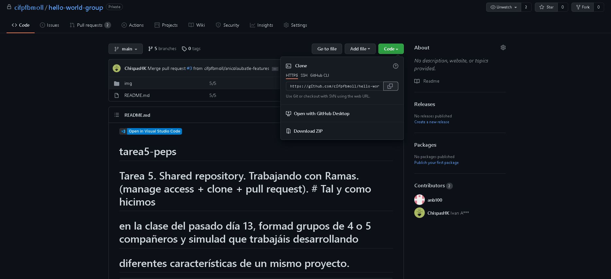
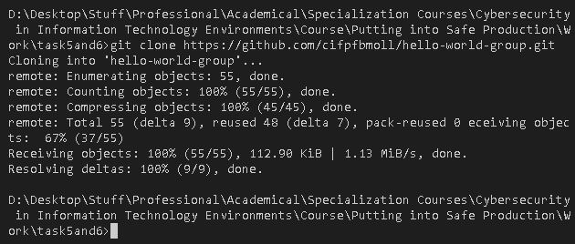
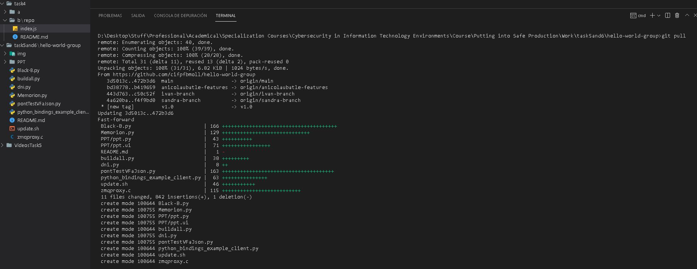
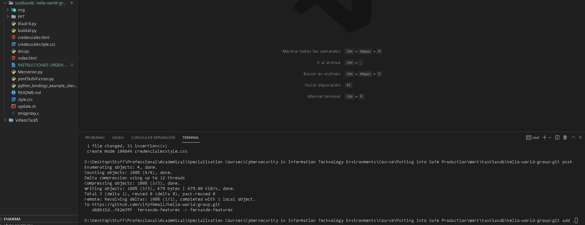
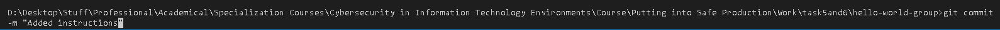
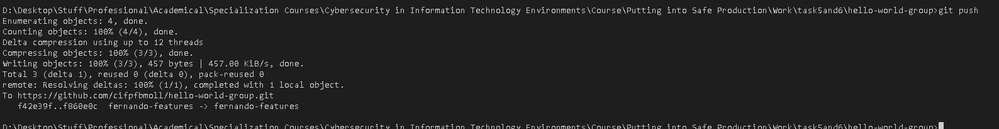
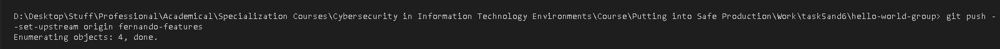
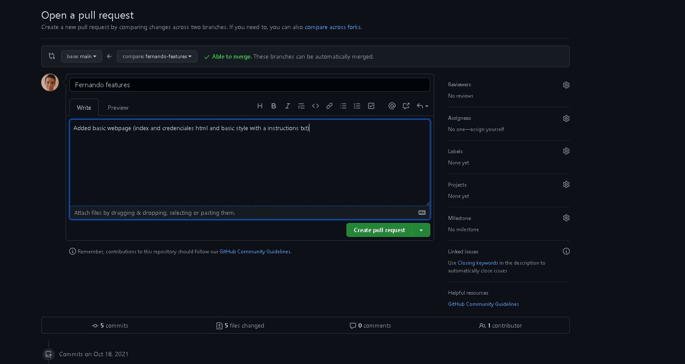
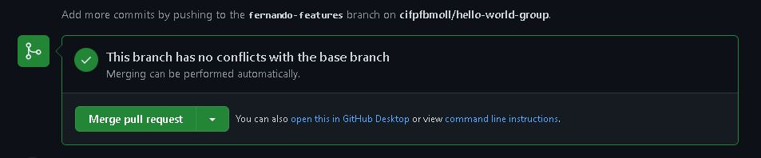
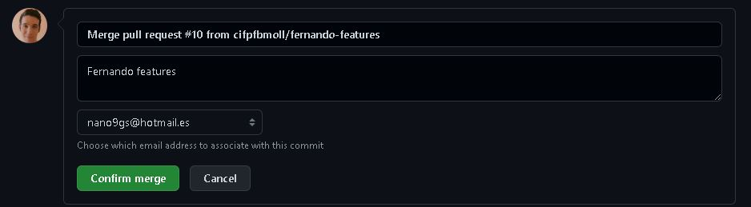

# tarea5-peps
Tarea 5. Shared repository. Trabajando con Ramas

## Tarea 5

### Enlace al vídeo explicativo: 
[Video tutorial](https://youtu.be/83IuqFAIWPg)

### Enlace al repostorio grupal:
[Repositorio grupal](https://github.com/cifpfbmoll/hello-world-group.git)

1.  

Copiamos el link del repo para el clone

2.  

Hacemos el clone

3.  

Hacemos pull para traer todos los cambios

4.  

Hacemos cambios (añadimos archivos) y hacemos git add

5.  

Hacemos commit

6.  

Hacemos push. Y repetimos del paso 4 al 6 unas 5 veces

7.  

Hacemos este tipo de push (no el del paso 6) SÓLO la primera vez que hacemos push y no está nuestra rama en el repo remoto

7.  

Abrimos una pull request con un mensaje.

8.  

Hacemos merge de la pull request

9.  

Mergeamos con un mensaje y damos a Confirm merge