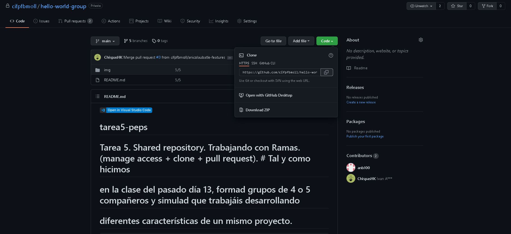
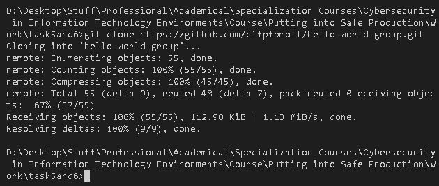
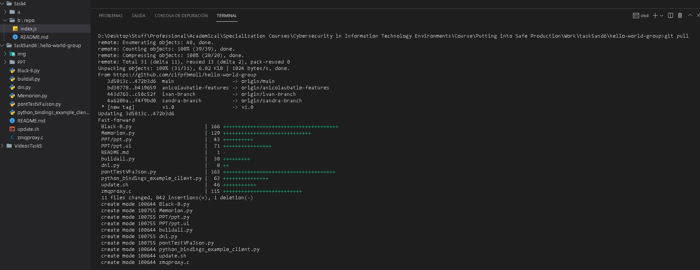
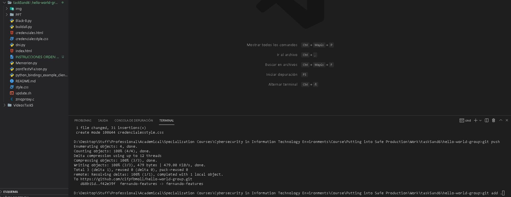
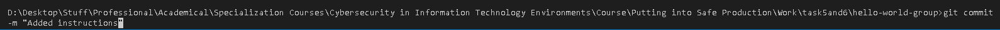
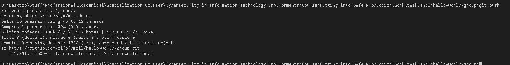
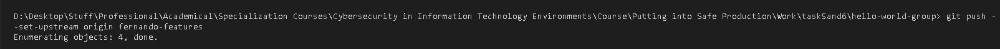
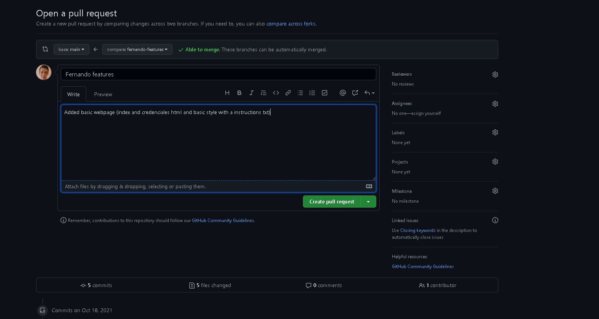
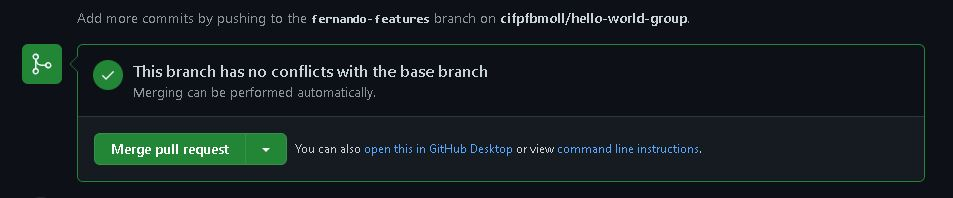
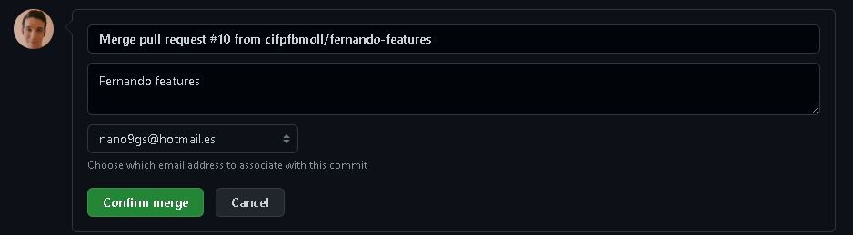

# tarea5-peps
Tarea 5. Repositorio compartido: trabajo con ramas

## Tarea 5

### Enlace al vídeo explicativo: 
[Vídeo tutorial](https://youtu.be/83IuqFAIWPg)

### Enlace al repositorio grupal:
[Repositorio grupal](https://github.com/cifpfbmoll/hello-world-group.git)

1.  

Copiamos el enlace del repositorio para clonarlo

2.  

Clonamos el repositorio

3.  

Hacemos pull para incorporar todos los cambios

4.  

Hacemos cambios (añadimos archivos) y ejecutamos git add

5.  

Hacemos commit

6.  

Hacemos push y repetimos los pasos del 4 al 6 unas cinco veces

7.  

Hacemos este tipo de push (no el del paso 6) solo la primera vez que hacemos push y nuestra rama todavía no está en el repositorio remoto

7.  

Abrimos una pull request con un mensaje.

8.  

Fusionamos la pull request

9.  

Confirmamos la fusión con un mensaje